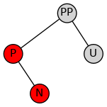
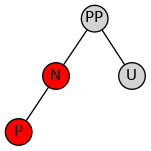
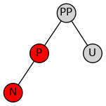
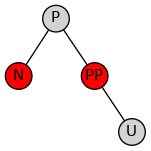

# Red-Black Tree

## Definition

1. Every node has a color either red or black.
2. The root of the tree is always black.
3. There are no two adjacent red nodes (A red node cannot have a red parent or red child).
4. Every path from a node (including root) to any of its descendants NULL nodes has the same number of black nodes.
5. All leaf nodes are black nodes.

## Insertion

### Core

For red child and black parent, exchanging their color and rotate parent tree, the red child will transfer to opposite subtree.

### Cases

First of all, insert node is red. We have cases as follows:

#### Parent is **black**

no rule is broken. **Easy**.

#### Parent is **red**.

Cause of rule 4 is broken, we have to rebalance the tree.

The key to rebalance is looking at **uncle node**.

##### Uncle node is red.

The grandparent must be **black**, we change parent & uncle tobe black, and grandparent to red.

Every node keep the rules except grandparent, cause we don't know what is his/her parent's color.

But for now, we can transfer insert node to grandparent, then, we can solve it recursively upward.

##### Uncle node is **black**.

Grandparent must be black.

Cause three is symmetrical, inserting right node is equivalent to inserting left node.

Next, we introduce how to rebalance inserting node in left subtree.

First, if parent is left child and i am right child.

If we do right rotation directly, my new parent is still red.

We can rotate subtree that root is parent first, then the situation is as follow.

I am left child and my parent is left child now. It is same as inserting left node with left parent.

Rotating root of grandparent, the tree will be balance.

## Deletion

###Core 

## Reference

[2-3-4 trees &amp; rbtree.pdf](https://www.cs.purdue.edu/homes/ayg/CS251/slides/chap13b.pdf)

[ngx_rbtree.c](https://github.com/nginx/nginx/blob/master/src/core/ngx_rbtree.c)
