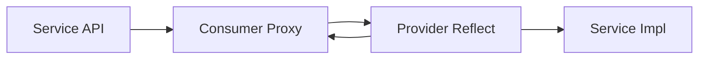

# Introduction about RPC(Remote Procedure Call)

Service API      : define specifications of service's interfaces

Consumer Proxy   : proxy of Service API, conmunicating with server by socket, 
  including write paramters of invoking and read result object.
  Make it easy for complex logic about conmunication and get result.

Provider Reflect : service provider. Locating concrete method by input 
  parameters with socket, invoking service and send result to Consumer Proxy.

Service Impl     : implementation of remote procedure

