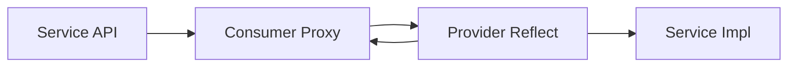

# Introduction about RPC(Remote Procedure Call)

## RPC Framework

Service API      : define specifications of service's interfaces

Consumer Proxy   : proxy of Service API, conmunicating with server by socket, including write paramters of invoking and read result object.  Make it easy for complex logic about conmunication and get result.

Provider Reflect : service provider. Locating concrete method by input parameters with socket, invoking service and send result to Consumer Proxy.

Service Impl     : implementation of remote procedure

## Service-Oriented Architecture(SOA) governance

服务治理内容广泛，此处归纳如下几方面：

+ 服务注册与发现
+ 软负载
+ 服务质量监控与服务指标数据采集
+ 记录负责人
+ 服务分组路由（灰度发布）
+ 服务依赖关系分析
+ 服务降级
+ 服务权重调整
+ 服务调用链路跟踪
