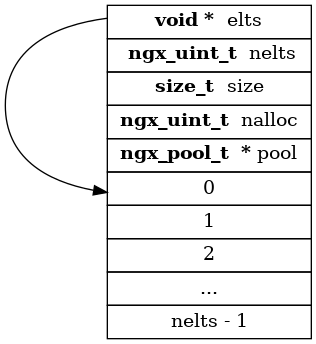

# ngx_array_t



```c
typedef struct {
    void        *elts;      // 元素数组
    ngx_uint_t   nelts;     // 存储元素个数
    size_t       size;      // 单个元素字节数
    ngx_uint_t   nalloc;    // 当前空间容纳的最大元素个数
    ngx_pool_t  *pool;      // 所属内存池对象
} ngx_array_t;
```

- `ngx_array_t *ngx_array_create(ngx_pool_t *p, ngx_uint_t n, size_t size)`

    需要指定所属的内存池对象`pool`，先在pool中分配array头部空间，并初始化元素个数=0
    `n`表示最大容纳元素个数
    `size`为单个元素字节大小
    然后再从`pool`中分配`n * size`大小的空间作为array的存储空间
    最终返回指向array头部地址的指针

- `void ngx_array_destroy(ngx_array_t *a)`

    尝试回收该array对象内存空间
    当且仅当该array是`pool`分配空间的最后一个对象
    即`pool`在分配array后又分配其他对象空间，则无法回收array内存，只能等`pool`回收时统一回收

- `void *ngx_array_push(ngx_array_t *a)`

    向`array`添加元素
    * 当前`array`已满
        + `array`是`pool`最后一个对象，且当前池子剩余空间足够容纳一个元素，则从当前内存追加一个元素空间，算是一种优化
        + `array`非`pool`最后一个对象，或空间不足以容纳一个元素，则从`pool`中重新分配**2**倍于当前空间的数据，并将当前元素全部拷贝至新空间，老空间无法使用，待`pool`统一回收

    * 当前`array`未满
        + 直接从尾部追加一个元素
    返回指针为新添加元素，实际内存并未赋值，所以调用push后需要对返回值进行赋值操作


- `void *ngx_array_push_n(ngx_array_t *a, ngx_uint_t n)`

    同`ngx_array_push`，添加多个元素，返回值指向新添加的第一个元素地址
