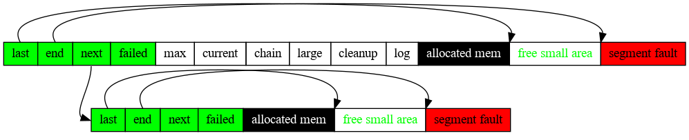

# ngx_pool_t



```c
typedef struct {
    u_char               *last;
    u_char               *end;
    ngx_pool_t           *next;
    ngx_uint_t            failed;
} ngx_pool_data_t;
```

```c
typedef struct ngx_pool_s {
    ngx_pool_data_t       d;
    size_t                max;
    ngx_pool_t           *current;
    ngx_chain_t          *chain;
    ngx_pool_large_t     *large;
    ngx_pool_cleanup_t   *cleanup;
    ngx_log_t            *log;
} ngx_pool_t;
```

- `ngx_pool_t ngx_create_pool(size_t size, ngx_log_t *log)`

    创建内存池，分配内存，并初始化内存池管理信息

- `void ngx_destroy_pool(ngx_pool_t *pool)`

    析构内存池，释放内存池所有内存空间，包括large所指内存池外内存空间

- `void ngx_reset_pool(ngx_pool_t *pool)`

    重置内存池至初始化状态，所有空间未分配

- `void *ngx_palloc(ngx_pool_t *pool, size_t size)`

    从内存池中分配`size`指定大小空间
    `size < max`, 从池中分配small对象，且**对齐内存**
    否则内存池中构造large对象，并指向额外分配的内存空间

- `void *ngx_pnalloc(ngx_pool_t *pool, size_t size)`

    同`ngx_palloc`，分配small对象时**不对齐内存**

- `void *ngx_palloc_small(ngx_pool_t *pool, size_t size, ngx_uint_t align)`

    分配较小空间，当前池子空间不足时，追加`block`空间，以链表形式管理

- `void *ngx_palloc_block(ngx_pool_t *pool, size_t size)`

    构造拓展的block空间，并以链表形式加入`pool`对象
    同时内存池中分配`size`大小的内存空间

- `void *ngx_palloc_large(ngx_pool_t *pool, size_t size)`

    内存池中申请较大空间时，不再从池中分配
    而是在pool空间构造`large对象`指向额外分配的内存空间

- `void *ngx_pcalloc(ngx_pool_t *pool, size_t size)`

    在`ngx_palloc`基础上，将分配内存的值初始化为 0

- `void *ngx_pmemalign(ngx_pool_t *pool, size_t size, size_t alignment)`

- `ngx_int_t ngx_pfree(ngx_pool_t *pool, void *p)`

    释放所有large空间

- `ngx_pool_cleanup_t *ngx_pool_cleanup_add(ngx_pool_t *p, size_t size)`

- `void ngx_pool_run_cleanup_file(ngx_pool_t *p, ngx_fd_t fd)`

- `void ngx_pool_cleanup_file(void *data)`

- `void ngx_pool_delete_file(void *data)`

